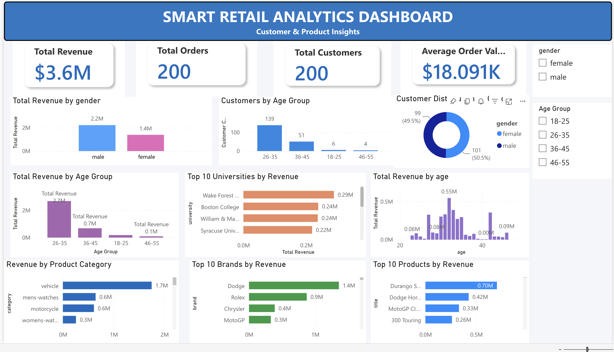

# End-to-End Smart Retail Analytics Platform

## Project Overview

Designed and built an end-to-end cloud-based Retail Analytics Platform using Microsoft Azure to simulate a real-world retail data ecosystem. The project ingests data from REST APIs, processes and transforms it through ETL pipelines, stores curated datasets in a dimensional data warehouse, and delivers actionable business insights through interactive Power BI dashboards.

The objective of this project was to gain hands-on experience with Data Engineering, Data Warehousing, Business Intelligence, and Cloud Analytics by implementing industry-standard data pipeline architecture and reporting workflows.

---

## Architecture

```text
DummyJSON API
        ↓
Python ETL
        ↓
Azure Data Lake Storage Gen2 (Raw Layer)
        ↓
Azure Data Factory
        ↓
Azure Data Lake Storage Gen2 (Processed Layer)
        ↓
Azure SQL Database
        ↓
Power BI Dashboard
        ↓
AI Business Insights Engine (In Progress)
```


---

## Dataset Statistics

| Dataset    | Records |
| ---------- | ------: |
| Products   |     194 |
| Users      |     200 |
| Carts      |     200 |
| Categories |      24 |

---

## Technology Stack

### Data Engineering

* Azure Data Factory (ADF)
* Azure Data Lake Storage Gen2 (ADLS Gen2)
* Azure SQL Database
* ETL Pipeline Development
* Data Warehousing
* Data Modeling

### Analytics & BI

* Power BI
* DAX
* Power Query
* Excel

### Programming

* Python
* SQL
* Pandas
* NumPy

### Cloud & Integration

* Microsoft Azure
* REST APIs
* JSON Data Processing

---

## Key Features

* Automated data ingestion from REST APIs
* Cloud-based data lake architecture
* End-to-end ETL pipeline development
* Data cleaning, transformation, and validation
* Star schema data warehouse design
* Automated data loading into Azure SQL Database
* Interactive Power BI dashboards
* KPI monitoring and business reporting
* Revenue, customer, and product analytics
* Scalable architecture for future AI integration

---

## Data Warehouse Design

A dimensional data model was implemented using a star schema architecture to support analytical workloads and reporting requirements.

### Fact Tables

#### fact_carts

Stores cart-level transactional metrics including:

* Total Amount
* Discounted Amount
* Product Count
* Quantity Purchased
* User Reference

#### fact_cart_items

Stores product-level transaction details including:

* Product ID
* Product Name
* Quantity
* Price
* Item Revenue
* Discounted Revenue

### Dimension Tables

#### dim_products

Contains:

* Product Name
* Category
* Brand
* Price
* Rating
* Stock Status

#### dim_users

Contains:

* Customer Demographics
* Age
* Gender
* University
* Age Group

This model improves reporting performance and simplifies analytical queries in Power BI.

---

## Azure Data Factory Pipeline

Developed multiple Azure Data Factory pipelines to automate data ingestion and warehouse loading.

### Pipelines

* pl_dynamic_ingestion
* pl_load_dim_users
* pl_load_dim_products
* pl_load_fact_carts
* pl_load_fact_cart_items

The pipeline architecture separates ingestion, transformation, and loading processes, making the solution easier to maintain and scale.


---

## Data Transformation Flow

Transformation logic was implemented using Python and Azure Data Factory to:

* Clean and standardize source data
* Handle missing and inconsistent values
* Create derived business attributes
* Generate Age Groups for customer segmentation
* Generate Stock Status indicators
* Flatten nested cart-product structures
* Create fact and dimension tables
* Validate row counts and data integrity before loading


---

## Azure SQL Data Warehouse

Curated datasets were loaded into Azure SQL Database to serve as the central analytics layer for reporting and business intelligence.

Warehouse Tables:

* dbo.dim_users
* dbo.dim_products
* dbo.fact_carts
* dbo.fact_cart_items


---

## Power BI Dashboard

Developed interactive dashboards to analyze:

* Revenue Performance
* Customer Demographics
* Product Category Performance
* Brand Performance
* Top Products
* Business KPIs

### KPI Metrics

* Total Revenue
* Total Orders
* Total Customers
* Average Order Value (AOV)

### Dashboard Overview



### Revenue Analysis


### Product Category Analysis


### Top Products Analysis


### User Demographics


---

## Business Insights Generated

* Customers aged 26–35 generated the highest revenue and represented the most valuable customer segment.
* Male customers contributed the majority of total revenue across the dataset.
* Vehicle products emerged as the highest-performing product category.
* Revenue was concentrated among a relatively small number of top-performing products and brands.
* University-level customer segmentation revealed distinct spending patterns across customer groups.
* Automated KPI tracking improved reporting efficiency and business visibility.

---

## Challenges & Learnings

* Flattened nested JSON structures from the carts API into relational fact tables suitable for analytics.
* Designed and implemented a star schema data warehouse to support scalable reporting.
* Built cloud-native ETL pipelines using Azure Data Factory and Azure Data Lake Storage.
* Implemented validation checks to ensure data quality and warehouse consistency.
* Optimized Power BI relationships and DAX measures for accurate reporting and performance.
* Gained practical experience across Data Engineering, Cloud Analytics, Data Warehousing, and Business Intelligence workflows.

---

## Future Enhancements

### AI Business Insights Engine (In Progress)

* Automated executive summary generation using LLMs
* AI-generated business recommendations
* KPI-based insight generation using OpenAI APIs
* Natural Language Analytics Assistant (Text-to-SQL)

Example:

User Query:

```text
Which category generated the highest revenue?
```

AI generates SQL, executes the query, and returns the answer automatically.

---

## Repository Structure

```text
End_to_End_Smart_Retail_Analytics_Platform/
│
├── data/
│   ├── raw/
│   └── processed/
│
├── pipelines/
│   └── adf/
│
├── sql/
│   ├── validation_queries.sql
│   └── business_analytics.sql
│
├── ai/
│   ├── kpi_extractor.py
│   ├── prompt_builder.py
│   ├── insight_generator.py
│   └── generated_reports/
│
├── screenshots/
│
└── README.md
```

---

## Author

**Priyanshu Yadav**

B.Tech (Hons.) Computer Science Engineering graduate from Manipal University Jaipur with experience in Azure Data Engineering, Data Analytics, SQL, Python, Power BI, and Business Intelligence. Interested in Data Analyst, Analytics Engineer, and Data Engineer opportunities focused on building scalable data platforms and data-driven solutions.
