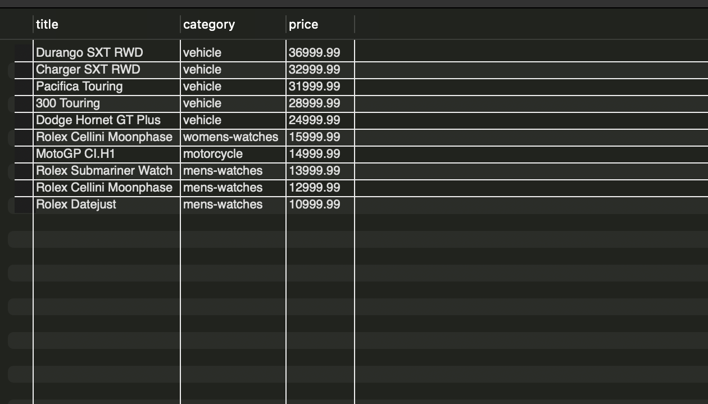
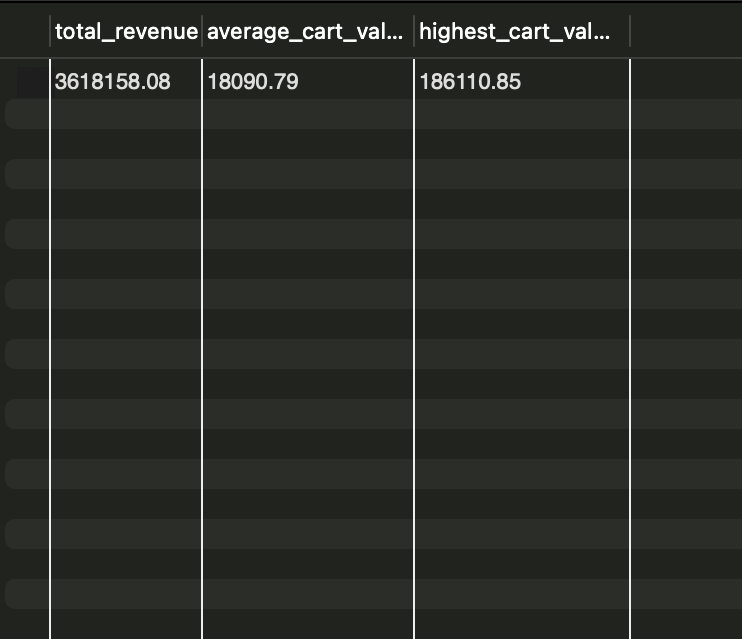
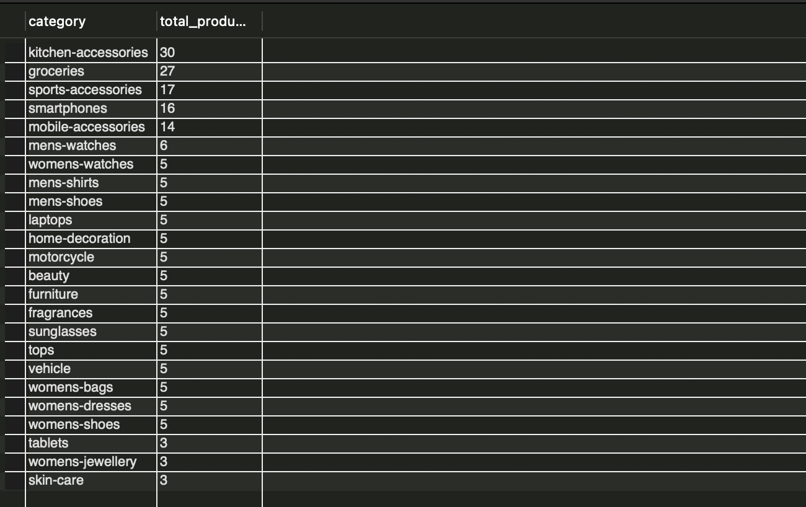
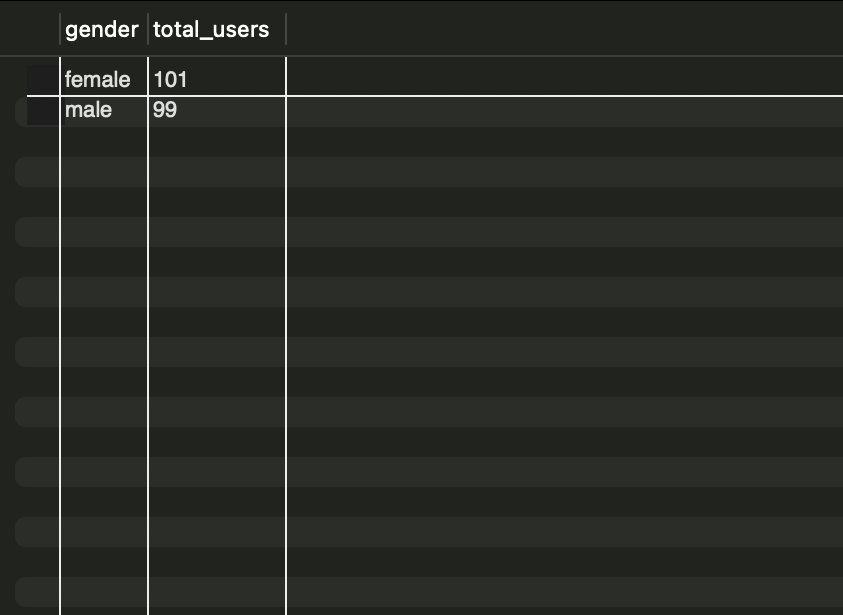

# End-to-End Smart Retail Data Platform

## Project Overview

Built an end-to-end Data Engineering project using Python, Pandas, SQL, and MySQL.

The project extracts retail data from the DummyJSON API, performs data cleaning and transformation, loads the processed data into a data warehouse, validates data quality using SQL, and generates business analytics insights.

---
## Dataset Statistics

| Dataset | Records |
|----------|---------:|
| Products | 194 |
| Users | 200 |
| Carts | 200 |
| Categories | 24 |

## Tech Stack

* Python
* Pandas
* SQL
* MySQL
* REST APIs
* Git & GitHub

---
## Key Features

- API Data Extraction using Python
- Data Cleaning and Transformation using Pandas
- Data Warehouse Design using MySQL
- Data Validation and Quality Checks
- Business Analytics using SQL
- ETL Logging Framework
- Modular Project Structure

## Project Architecture

DummyJSON API
↓
Data Extraction Layer
↓
Raw CSV Storage
↓
Data Transformation (Pandas)
↓
Processed CSV Storage
↓
MySQL Data Warehouse
↓
SQL Validation Layer
↓
Business Analytics Layer
↓
ETL Logging Framework

---

## Dataset

### Products

* Product information
* Categories
* Pricing
* Ratings
* Inventory

### Users

* Customer information
* Demographics
* User profiles

### Carts

* Shopping cart transactions
* Revenue metrics

---

## ETL Workflow

### Extraction

* Fetched data from DummyJSON APIs
* Stored raw datasets in CSV format

### Transformation

* Removed duplicates
* Handled missing values
* Standardized column names
* Created derived business metrics

### Loading

* Loaded cleaned datasets into MySQL tables:

  * dim_products
  * dim_users
  * fact_carts

### Validation

* Duplicate checks
* Record count validation
* Data quality verification

### Analytics

* Product category analysis
* Revenue analysis
* User demographic analysis
* Inventory analysis

---

## ETL Logging

Implemented a centralized ETL logging framework to capture:

* Pipeline name
* Records processed
* Execution timestamp
* Pipeline status

---

## Project Structure

```text
End_to_End_Smart_Retail_Data_Platform

data/
├── raw/
├── processed/

scripts/
├── extraction/
├── transformation/
└── utils/

sql/
├── validation_queries.sql
├── business_analytics.sql
└── etl_logging.sql

screenshots/

README.md
```

---

## Future Enhancements

* Azure Blob Storage Integration
* Azure Data Factory Pipeline
* Power BI Dashboard
* Incremental Data Loading
* Cloud-Based Data Warehouse

## Project Screenshots

### Top 10 Most Expensive Products



### Revenue Analysis



### Products by Category



### User Demographics




---

## Author

Priyanshu Yadav
Aspiring Data Engineer